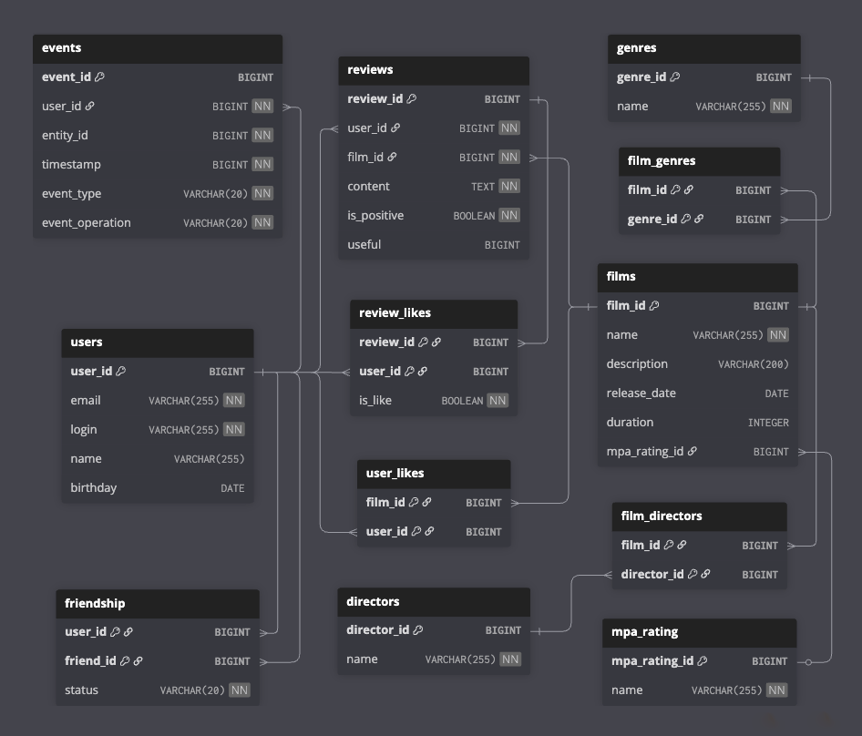

# Filmorate Database Schema

## ER-диаграмма

---

## Описание схемы

Сервис «**Filmorate**» хранит информацию о фильмах, пользователях, их взаимодействиях и социальной активности. В
базе реализованы следующие возможности:

- Регистрация и профили пользователей
- Лайки фильмов
- Отзывы и оценки фильмов
- Социальная сеть: добавление в друзья, статусы дружбы
- Рекомендации: общие фильмы с друзьями
- Лента событий: история всех действий пользователей
- Поиск по названию и описанию фильма

### Таблицы

1. **films**
    - Содержит данные о фильмах: название, описание, дата выпуска, продолжительность, жанры, рейтинг MPA.
2. **film_genres**
    - Реализует связь многие-ко-многим между фильмами и жанрами.
3. **genres**
    - Список жанров (например, "Комедия", "Драма").
4. **mpa_rating**
    - Возрастные рейтинги (например, "PG-13", "R").
5. **directors**
   - Таблица режиссёров.
6. **film_directors**
   - Связь многие-ко-многим между фильмами и режиссёрами.
7. **users**
    - Данные пользователей: email, логин, имя, дата рождения.
8. **friendship**
    - Хранит связи дружбы между пользователями и их статусы (принято/в ожидании).
9. **user_likes**
    - Лайки пользователей к фильмам (связь многие-ко-многим).
10. **reviews**
    - Отзывы пользователей о фильмах: текст, оценка, полезность.
11. **review_likes**
    - Лайки/дизлайки к отзывам пользователей (связь многие-ко-многим).
12. **events**
    - Лента событий: действия пользователей (лайки, добавление в друзья и т.д).

### Основные связи

- films ↔ genres: через `film_genres`
- films ↔ directors: через `film_directors`
- films ↔ user_likes: пользователи лайкают фильмы
- users ↔ friendship: социальная связь и статусы дружбы
- reviews ↔ review_likes: пользователи оценивают отзывы
- events агрегируют все действия пользователей для ленты

---